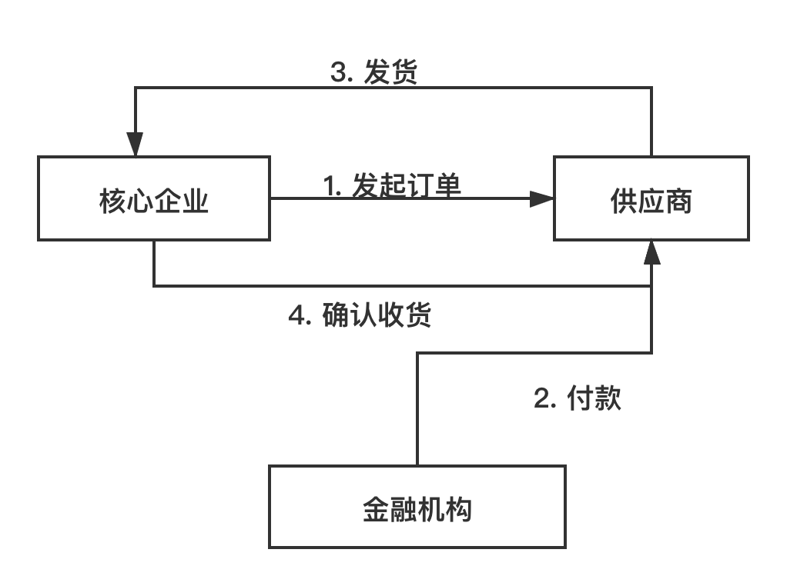
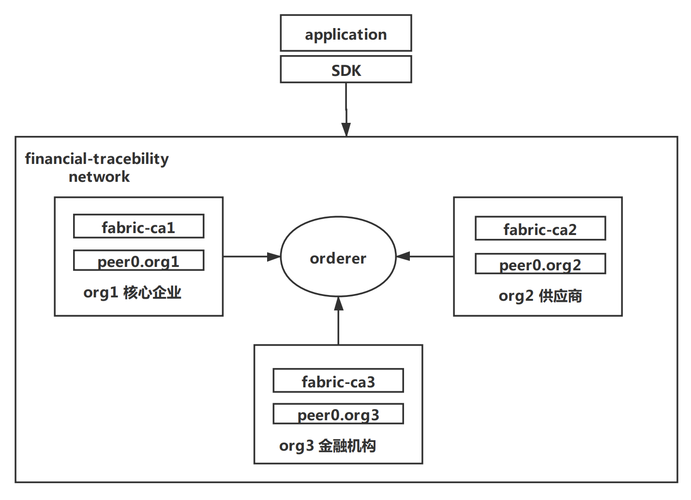

# 金融溯源项目

## 背景
供应链金融是银行围绕核心企业，管理企业的资金流和物流的一种金融服务。因为涉及到多个组织的参与，并且供应链运行的过程中，交易信息都分散在不同的企业系统内，导致整个供应链信息的不透明，不顺畅，各个参与者都难以去了解交易的进展情况，其不透明性导致了整个过程十分繁琐，影响了交易效率。

以上供应链金融的痛点，可以很好地采用区块链来解决，特别是联盟链 hyperledger fabric。fabric拥有去中心化、时序数据、集体维护、可编程的智能合约和安全可信等特点，因为fabric 区块链自带的时间戳和数据不可篡改性，可以根本上解决贸易背景真实性的问题。



在本例中，选取了一个简化的业务模型。该模型中有三个组织的参与，分别是核心企业、供应商和金融机构，以核心企业发起一个订单，然后供应商供货，金融机构负责付款为背景。

## 区块链网络



这个区块链网络中的state为 order 订单，order的状态经历这样的变化:
```
--> Launched --> Paid --> Dispatching --> Comfirmed
```

其中transation分别是 发起订单(LaunchOrder)、付款(PayOrder)、发货(Dispatch)、确认收货(Comfirm)。所以，chaincode中的函数应该是对应到这四个transition。

order的具体例子：
```json
{
    "orderID" : "111",
    "orderPrice" : 12345,
    "orderLaunchTime" : "",
    "orderPayTime" : "",
    "orderDispatchTime" : "",
    "orderConfirmTime" : "",
    "orderState" : "PAID",
    // .....
    // 因为这是简化版本的例子，具体业务中可能存在多个供应商和核心企业，所以应该还会有供应商信息和核心企业信息等属性
}
```

- 核心企业: 需要调用`LaunchOrder`、`Comfirm`接口。
- 供应商: 需要调用`Dispatch`接口。
- 金融机构: 需要调用`PayOrder`接口。

## 网络搭建和启动

### 1. identity相关文件生成
首先生成模板：`cryptogen showtemplate > cryto-config.yaml`，然后修改[cryto-config.yaml](./cryto-config.yaml)文件来符合我们的区块链网络设定，包括org和org有多少peer。

然后`cryptogen generate --config=./crypto-config.yaml --output="crypto-config"`生成相关文件到`crypto-config/`目录下。

### 2. orderer gensisi block 和 channel transaction
拷贝一个模板过来[configtx.yaml](./configtx.yaml)`，然后根据自己的组织架构来修改配置，主要就是organizations和profiles。另外，可以根据自己的要求来修改policies，来配置访问权限。

- `configtxgen -profile TestOrgOrdererGenesis -channelID finan-channel -outputBlock ./channel-artifacts/genesis.block` 生成orderer genesis block。

- `configtxgen -profile TestOrgChannel -outputCreateChannelTx ./channel-artifacts/channel.tx -channelID finan-channel` 生成 channel transaction。

- `configtxgen -profile TestOrgChannel -outputAnchorPeersUpdate ./channel-artifacts/Org1MSPanchor.tx -channelID finan-channel -asOrg Org1MSP` 等三条命令分别生成anchor transaction，用来在org1、2、3的peer上面安装channel的anchor。

### 3. docker compose file编写
docker compose包括orderer, peer, cli, ca和couchdb等几个容器。

整个网络需要运行的各个service:
```
ca1.example.com
ca2.example.com
ca3.example.com
orderer.example.com
couchdb
peer0.org3.example.com
peer0.org2.example.com
peer0.org1.example.com
cli
```

调整好volume、port以及env等参数后，`docker-compose -f ./docker-compose.yaml up -d ...`命令来运行容器，构建好网络。

## chaincode编写与安装

利用`fabric-samples`里面的封装过的一层API，可以很方便的编写chaincode，逻辑很简单。

然后就是安装chaincode。

## application编写和调用